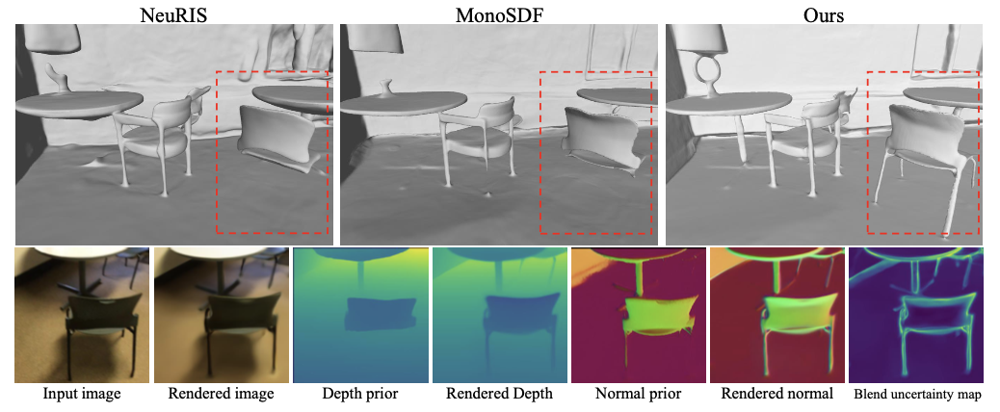

# DebSDF: Delving into the Details and Bias of Neural Indoor Scene Reconstruction



[[Arxiv](https://arxiv.org/abs/2308.15536)] [[Project page](https://davidxu-jj.github.io/pubs/DebSDF/)] (Arxiv 2023)


# Abstract

In recent years, the neural implicit surface has emerged as a powerful representation for multi-view surface reconstruction due to its simplicity and state-of-the-art performance. However, reconstructing smooth and detailed surfaces in indoor scenes from multi-view images presents unique challenges. Indoor scenes typically contain large texture-less regions, making the photometric loss unreliable for optimizing the implicit surface. Previous work utilizes monocular geometry priors to improve the reconstruction in indoor scenes. However, monocular priors often contain substantial errors in thin structure regions due to domain gaps and the inherent inconsistencies when derived independently from different views. This paper presents DebSDF to address these challenges, focusing on the utilization of uncertainty in monocular priors. We propose an uncertainty modeling technique that associates larger uncertainties with larger errors in the priors. High-uncertainty priors are then excluded from optimization to prevent bias. This uncertainty measure also informs an importance-guided ray sampling and adaptive smoothness regularization, enhancing the learning of fine structures. We further introduce a bias-aware signed distance to density transformation that takes into account the curvature radius and the angle between the view direction and the SDF normals to better reconstruct fine details. Our approach has been validated through extensive experiments on several challenging datasets, demonstrating improved qualitative and quantitative results in reconstructing thin structures in indoor scenes, thereby outperforming previous work. The code will be made publicly available.

# Video Preview


More results are presented in the [project page](https://davidxu-jj.github.io/pubs/DebSDF/).

# Bibtex
```bibtex
@misc{xiao2023debsdf,
      title={DebSDF: Delving into the Details and Bias of Neural Indoor Scene Reconstruction}, 
      author={Yuting Xiao and Jingwei Xu and Zehao Yu and Shenghua Gao},
      year={2023},
      eprint={2308.15536},
      archivePrefix={arXiv},
      primaryClass={cs.CV}
}
```
